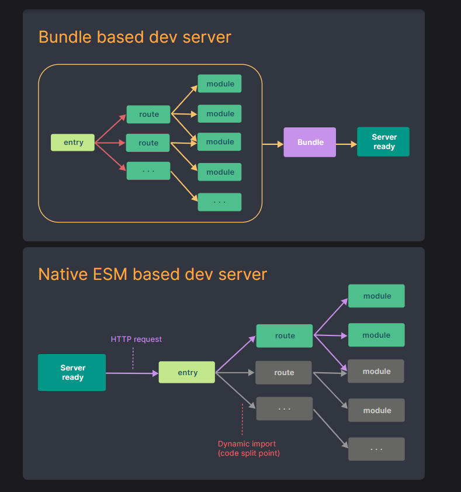
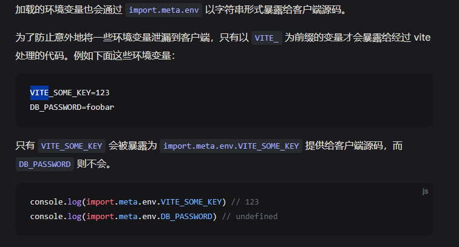

# Vite
vite与webpack 相比的优势：
* 1.vite不会解析所有模块后再启动服务器，webpack会先统一所有模块化，解析完后再开启服务器，导致开启服务器时间随项目体量增大而增多，这里说的是开启服务器就是指我们前端平时开发时输入命令（npm run dev,npm run serve,npm run start,yarn start...）开启的本地开发服务器
* 2.vite使用自己自家的esbuild打包，重写了所有依赖的内置依赖，将一个依赖的所有内置依赖都重写到了一个文件里，这使得浏览器在请求文件的时候，只需要额外的请求这个单文件就行了，大大减少http请求次数，毕竟很多三方模块他的内置有很多依赖模块的，如果不加处理，则浏览器会加载所有的模块依赖请求，这也是浏览器自身不敢支持默认从nodemodules里面查找依赖的原因，一发而不可收拾！
* 3.跟第一点类似，他解析的时候只解析当前用到的文件，没有用到的则不会处理，而webpack是解析完了后再打包然后启动服务器,关系入下图（也是vite官方给的图）


## vite配置文件细节处理
### vite配置文件的语法提示
1.可以通过import {defineConfig} from 'vite',然后export default defineConfig({...})这样的形式处理，这样可以再defineConfig里面写配置项的时候，能获得配置类型提示
```
import { defineConfig } from 'vite';
export default defineConfig({
  resolve: {
    alias: {
      '@': path.resolve(__dirname, './src'),
    },
  },
  plugins: [vue()],
  ...
});
```
### 关于vite的环境处理
1.关于在环境变量的使用场景，就是针对不同的环境进行不同的参数值的设置，比如开发环境的接口请求ip地址与线上的肯定是不一样的，这里就可以用环境变量来处理
#### 环境变量使用的事相
* 1.vite默认的环境变量有staging，development，production
* 2.当你想创建一个.env.otherName 的文件的时候，可以通过在启动命令里面 输入 --mode otherName来使得vite去根据mode去读取对应的文件来获取对应的环境变量值
* 3.如何在业务代码里面访问环境变量————通过import.meta.env这个大的对象来获取我们自定义的环境变量，但是这里有个注意事项，默认情况下，通过import.meta.env访问的我们自定义的环境变量前缀只能是以VITE_开头的，其它前缀访问时是undefined

* 4.当然我们也可也通过配置修改我们的环境变量前缀，也不一定是非要用VITE_开头，在vite配置里面是通过'envPrefix'来进行控制
```
//vite.config.ts
export default defineConfig({
    envPrefix:"MYPREFIX_"
})
// .env
MYPREFIX_SOME_KEY=123
//业务代码里面访问
console.log(import.meta.env.MYPREFIX_SOME_KEY) //123
```