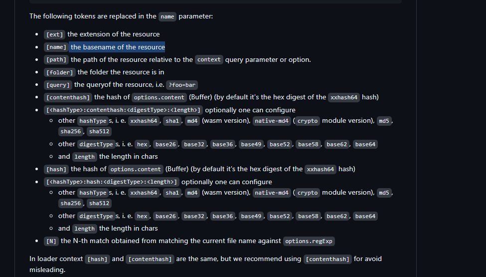

# Vite
vite与webpack 相比的优势(这也是vite的预构建)：
* 1.vite不会解析所有模块后再启动服务器，webpack会先统一所有模块化，解析完后再开启服务器，导致开启服务器时间随项目体量增大而增多，这里说的是开启服务器就是指我们前端平时开发时输入命令（npm run dev,npm run serve,npm run start,yarn start...）开启的本地开发服务器
* 2.vite使用自己自家的esbuild打包，重写了所有依赖的内置依赖，将一个依赖的所有内置依赖都重写到了一个文件里，这使得浏览器在请求文件的时候，只需要额外的请求这个单文件就行了，大大减少http请求次数，毕竟很多三方模块他的内置有很多依赖模块的，如果不加处理，则浏览器会加载所有的模块依赖请求，这也是浏览器自身不敢支持默认从nodemodules里面查找依赖的原因，一发而不可收拾！
* 3.跟第一点类似，他解析的时候只解析当前用到的文件，没有用到的则不会处理，而webpack是解析完了后再打包然后启动服务器,关系入下图（也是vite官方给的图）


## vite配置文件细节处理
### vite配置文件的语法提示
1.可以通过import {defineConfig} from 'vite',然后export default defineConfig({...})这样的形式处理，这样可以再defineConfig里面写配置项的时候，能获得配置类型提示
```
import { defineConfig } from 'vite';
export default defineConfig({
  resolve: {
    alias: {
      '@': path.resolve(__dirname, './src'),
    },
  },
  plugins: [vue()],
  ...
});
```
### 关于vite的环境处理
1.关于在环境变量的使用场景，就是针对不同的环境进行不同的参数值的设置，比如开发环境的接口请求ip地址与线上的肯定是不一样的，这里就可以用环境变量来处理
#### 环境变量使用的事相
* 1.vite默认的环境变量有staging，development，production
* 2.当你想创建一个.env.otherName 的文件的时候，可以通过在启动命令里面 输入 --mode otherName来使得vite去根据mode去读取对应的文件来获取对应的环境变量值
* 3.如何在业务代码里面访问环境变量————通过import.meta.env这个大的对象来获取我们自定义的环境变量，但是这里有个注意事项，默认情况下，通过import.meta.env访问的我们自定义的环境变量前缀只能是以VITE_开头的，其它前缀访问时是undefined

* 4.当然我们也可也通过配置修改我们的环境变量前缀，也不一定是非要用VITE_开头，在vite配置里面是通过'envPrefix'来进行控制
```
//vite.config.ts
export default defineConfig({
    envPrefix:"MYPREFIX_"
})
// .env
MYPREFIX_SOME_KEY=123
//业务代码里面访问
console.log(import.meta.env.MYPREFIX_SOME_KEY) //123
```
## vite预构建处理
作用：vite预构建前面已经提到了，就是提前将一个文件里的内置其它依赖都构建到一个文件里面，保证http请求次数减少
- optimizeDeps 控制预构建的配置项
* 提供一个exclude属性
```
{
  optimizeDeps:{
    exclude:['./xxx.js'] //将数组里面的包不再进行预构建，这意味这如果这个js包里面如果有许多内置依赖，那么再页面打开http请求后，会出现许多关于这个包的内置依赖包的请求
  }
}
```
## vite处理css
vite天生支持css（css,sass,scss...）的处理，但读取到的css会将css文件里面的内容全部以字符串的形式读出来，然后已经JavaScript的形式返回给浏览器，此时浏览器其实是把这个css文件当作JavaScript来处理的，这里补充一点，浏览器其实对返回的资源其实不关心这个文件的后缀名，浏览器只关心返回的响应头字段‘content-Type’，这里vite对css的文件处理其实在把css文件里面的内容提取出来后，重新覆盖了这个css文件，然后把content-Type设置成了‘application/javascript’,对于浏览器里面响应文件的其它类型的.vue文件也是类似的处理

### vite里的css.modules
* 作用或者说是什么：vite里的css.modules作用就是为了覆盖css模块化的默认行为
以下是vite的cssmodules的配置选项
```
interface CSSModulesOptions {
  getJSON?: (
    cssFileName: string,
    json: Record<string, string>,
    outputFileName: string,
  ) => void
  scopeBehaviour?: 'global' | 'local'
  globalModulePaths?: RegExp[]
  exportGlobals?: boolean
  generateScopedName?:
    | string
    | ((name: string, filename: string, css: string) => string)
  hashPrefix?: string
  /**
   * default: undefined
   */
  localsConvention?:
    | 'camelCase'
    | 'camelCaseOnly'
    | 'dashes'
    | 'dashesOnly'
    | ((
        originalClassName: string,
        generatedClassName: string,
        inputFile: string,
      ) => string)
}
```
- localsConvention选项
* 作用：就是规范样式类名的
localsConvention类型为string时，有如下选项配置

|options   |type  |描述|
-------|----|-----
camelCase|String|将样式新增一个驼峰式(例如.footerContent)
camelCaseOnly|String|将当前dash样式改成驼峰式
dashes|String|将样式新增一个dash(就是样式名中间有个'-',例如.footer-content)
dashesOnly|String|样式只有一个dash(就是样式名中间有个'-',例如.footer-content)

- scopeBehaviour选项
作用：开启是否对css进行模块化，global则表示关闭模块化

- generateScopedName
* 作用：生成作用域类名，例如：[name]__[local]___[hash:base64:5] //具体的名称占位符提示查看 https://github.com/webpack/loader-utils#interpolatename


- globalModulePaths
* 作用：以一个数组的方式去接受要处理的文件，被放进数组里面的文件将被指定为css模块化失效，将把它作为全局的css处理
```
globalModulePaths: [/path\/to\/legacy-styles/, /another\/paths/],
```

- hashPrefix
作用：就是让你生成的hash更加独特，更加唯一

* css.modules总结：感觉就是平时会很少用到，几乎这里再项目中都不会去特殊配置处理

### vite里的css.preprocessorOptions
* 作用：指定传递给 CSS 预处理器的选项。文件扩展名用作选项的键。每个预处理器支持的选项可以在它们各自的文档中找到


### css.devSourcemap?:boolean(在开发过程中是否启用 sourcemap)
作用：方便我们开发的过程中进行调试，比如哪行css出错了，或者我们想定位到哪个css，这样我们能看到的是我们项目中真实的这个css对应的位置，而不是打包压缩后的位置


