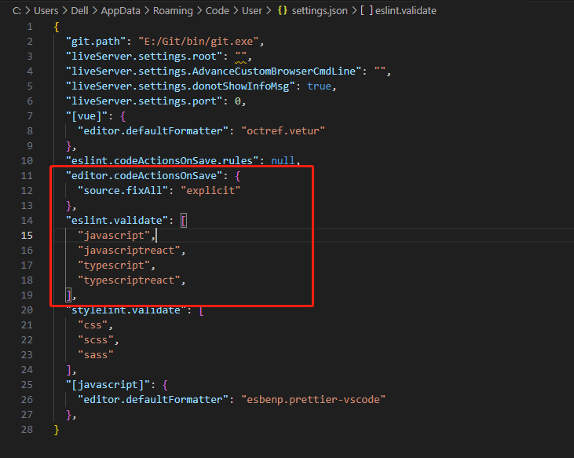

# 前言

* *本片是基于Vue项目进行的举例说明
eslint+VSCode+prettier这套组合拳其实还是找了很久的资料，才找到一套目前能正常处理的，中间碰到过许多问题如下：
* 跟着教程做，一模一样的步骤，但是就是后面不起作用
* 跟着教程走，但是作者写的教程里面不去表明eslint 、prettier的版本说明，导致版本根教程说的不一致，从而有些配置选项不一样
* VSCode这个软件本身的版本问题，部分版本的VSCode有些问题，目前我写这篇文章的VSCode版本是1.86.2
* eslint+prettier这套组合拳本身也有太多的额外的插件要下载下来了，而且不同作者写的用到的插件也是五花八门，没法统一去看导致学的时候也是有点力不从心，遇到问题也不好查，并且在依赖VSCode自动修复的时候，也没怎么提到VSCode里面下载的插件的配置，导致弄起来也是云里雾里的
后面我将在写笔记的时候，对每个用到的插件版本均作说明，以保证后续复习或者再次跟着做的时候，不至于困惑

# 正文

## VSCode(1.86.2)
VSCode 在插件库里面选择ESLint，Prettier这两个插件进行下载，然后下载好后，去设置里面进行参数配置，VSCode设置页面可以通过组合快捷键"Ctrl+Shift+P"打开选择栏，选择"Open User Setting"这一选项进行打开设置页面，然后添加如下配置

```
  "editor.codeActionsOnSave": {
    "source.fixAll": "explicit"
  },
  "eslint.validate": [
    "javascript",
    "javascriptreact",
    "typescript",
    "typescriptreact",
  ],
```

## ESLint+Prettier 在项目中进行下载

这个要下载的插件着实太多了，也是我想吐槽的，前端项目还没开始写，结果工程化插件和配置就整了一大堆；

### ESLint及相关插件下载

#### 下载插件
```
{
    ...
    "eslint": "^6.7.2",
    "babel-eslint": "^10.1.0",
    "eslint-config-prettier": "^6.15.0",
    "eslint-plugin-prettier": "^3.4.1",
    "eslint-plugin-vue": "^6.2.2",
}
```
```
npm install eslint@^6.7.2 babel-eslint@^10.1.0 eslint-config-prettier@^6.15.0 eslint-plugin-prettier@^3.4.1 eslint-plugin-vue@^6.2.2 -D  //通过npm将这些插件依次安装到项目里
```

#### 配置文件(.eslintrc.js、.prettierrc)

##### .eslintrc.js
配置如下：
```
module.exports = {
  root: true,
  env: {
    node: true
  },
  extends: [
    "plugin:vue/essential", //vue必要的代码质量检查插件，vue3->vue3/essential
    "eslint:recommended", //eslint 推荐规则
    "plugin:prettier/recommended" //prettier推荐规则
  ],
  parser: "vue-eslint-parser", //解析器vue项目里面可以不写，默认vue-eslint-parser，但是要在后面把parserOptions配上，它将依赖我们下载的插件babel-eslint去检查es6+的代码规范，不写eslint会报错：Unexpected token
  parserOptions: {
    parser: "babel-eslint", //告诉vue-eslint-parser内部才用我们提供的babel-eslint进行规范检查
    ecmaVersion: 2020
  },
  globals: {
    __webpack_public_path__: true //这个是针对于我们项目里面如果有存在全局的变量，那我们就可以在这个配置文件里面声明这个，告诉eslint我们全局有配置声明过这个变量，否则eslint报错提示未定义
  },
    // 规则的细节请到ESLint官方网站查看https://zh-hans.eslint.org/docs/latest/use/configure/rules
  /* 
  "off" 或 0 -关闭规则
  "warn" 或 1 - 开启规则, 使用警告 程序不会退出
  "error" 或 2 - 开启规则, 使用错误 程序退出
  */
  rules: {
    "no-unused-vars": "off",
    "vue/no-unused-vars": 0,
    "vue/no-reserved-keys": ["off"]
  }
};
```
.eslintignore 文件也要添加下，目的是为了告诉eslint哪些文件不做质量检查:
```
dist/*
node_modules/*
packages/*
public/*
```
##### .prettierrc
配置如下：
```
module.exports = {
  printWidth: 80, //一行的字符数，如果超过会进行换行，默认为80
  tabWidth: 2, //一个tab代表几个空格数，默认为80
  useTabs: false, //是否使用tab进行缩进，默认为false，表示用空格进行缩减
  singleQuote: false, //字符串是否使用单引号，默认为false，使用双引号
  semi: true, //行位是否使用分号，默认为true
  trailingComma: 'none', //是否使用尾逗号，有三个可选值"<none|es5|all>"
  bracketSpacing: true, //对象大括号直接是否有空格，默认为true，效果：{ foo: bar }
};
```


.prettierignore 文件也要添加下，目的是为了告诉prettier哪些文件不做美观检查:
```
fgw-web/*
node_modules/*
packages/*
public/*
```

至此咱们的ESLint+Prettier+VSCode的vue项目的代码质量规范就已经配置好了，后续有什么代码质量规范规则就在.eslintrc.js这个文件里面的rules里面进行修改就行了。代码的美观处理规则就在.prettierrc文件里面修改

这里小插一句：关于咱们在vscode里面下载的ESLint和Prettier与我们在项目里面通过npm下载的eslint、eslint-config-prettier、eslint-plugin-prettier之间有什么关系。这个在我学习eslint的时候还是挺困惑的，困惑点就是搞不清楚这两个有什么联系，为什么我在vscode里面下了后，在项目里面又要下载一遍。
* 其实在VSCode里面下载的那个eslint是为了方便我们本地开发，一保存就进行代码规范的自动修复并且代码在写的过程中就能检查提示出来我们的代码质量不符合规范，不然用npm 下载的那个eslint，我们还得用专门的eslint命令在终端里面输入 "npm run lint --fix"进行全局的代码检查修复,这样岂不是等于我们写完一个文件的代码都要去执行一遍这个命令，那这也太麻烦了，所以VSCode的eslint插件就帮我们做了这个事情，给予的VSCode能在我们编写代码的过程中就进行代码的质量检查了，并且还可以配置当我保存编辑好的文件时，自动将不符合规范的大部分代码按照规范修正好。


